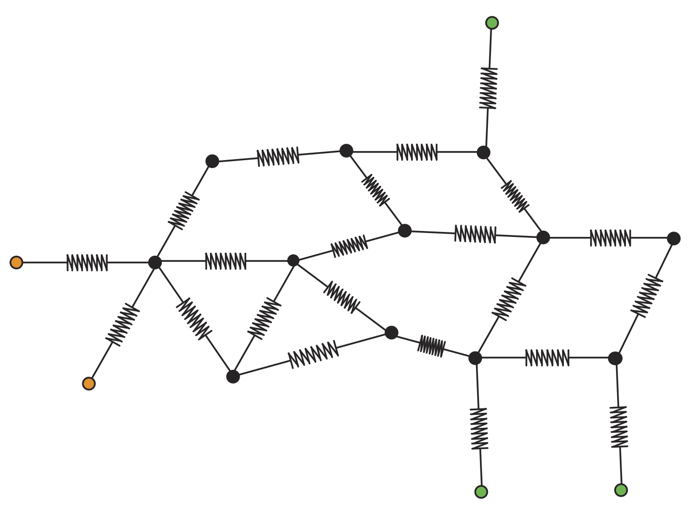
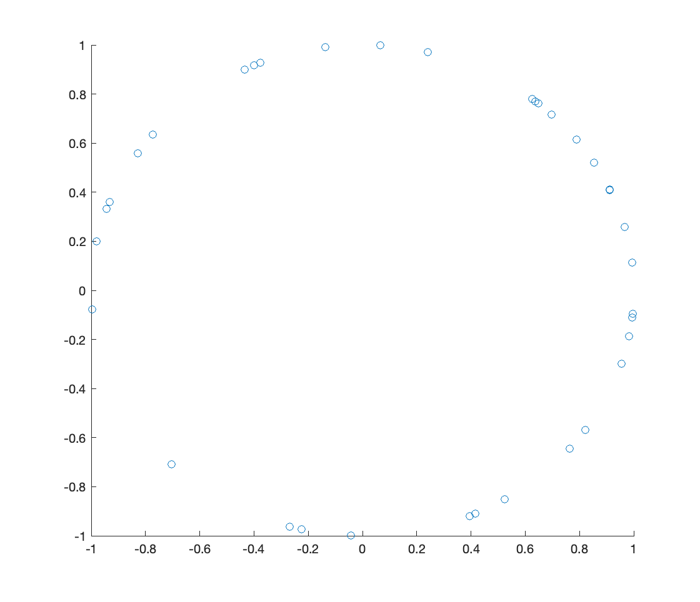

<p align="center">

  </p>

This is an implementation of the notion Persistent Laplacian first invented by Rui Wang, Duc Duy Nguyen, Guo-Wei Wei in the paper https://arxiv.org/abs/1912.04135. 

The algorithm implemented in this repo was developed by [Facundo Memoli](https://people.math.osu.edu/memolitechera.1/), [Zhengchao Wan](https://math.osu.edu/people/wan.252-0) and [Yusu Wang](http://yusu.belkin-wang.org) in the paper https://arxiv.org/abs/2012.02808. Our algorithm crucially exploits the notion of Kron reduction in network theory ([Dorfler and Bullo, 2013](https://ieeexplore.ieee.org/abstract/document/6316101?casa_token=4Cqb50382jwAAAAA:S9-3b_sQiDb-56C0yrhKSAW8RNJaC4dIAbK2rZUtFXNY2DoYOXQ9wlmVPJtksD1wCNcSkX4WKg)).

# persistent-Laplacian
## persistLap.m
**persistLap.m** is a Matlab implementation of the q-th persistent Laplacian of a simplicial pair via the Schur complement formulation.

**Syntax:**
```
% persistLap - computes the q-th (up) persistent Laplacian of a simplicial pair K in L
%
% [pL,upL] = persistLap(B1,B2,Gind)
%
%	B1 - the (q+1)-th boundary matrix of the large complex L
%	B2 - the q-th boundary matrix of the small complex K
%	Gind - index set of q-simplices of K in the set of q-simplices of L
%
% Returns:
%	pL - q-th persistent Laplacian
%	upL - q-th up persistent Laplacian
```
## boundary.py
**boundary.py** is a python code based on [dionysus](https://www.mrzv.org/software/dionysus2/) generating boundary matrices required by **persistLap.m**. It takes as input a point cloud and extracts two Vietoris-Rips complexes determined by two given thresholds as a simplicial pair K in L. The output consists of **q1Boundary.mat**: a (q+1)-boundary matrix of L, and **qBoundary.mat**: a q-boundary matrix of K, where q is the dimension specified by the user. 

## example
Inside the example folder, we include a point cloud file **Point.txt**, which represents a 35-point point cloud randomly generated from a circle illustrated in the figure below. We include two precomputed boundary matrices **q1Boundary.mat** and **qBoundary.mat** when q=2 for a Vietoris-Rips simplicial pair K in L with thresholds 1 and 1.5. **VR-persistLap** takes **q1Boundary.mat** and **qBoundary.mat** as input and compute the 2-persistent Laplacian and the corresponding eigenvalues.

<p align="center">

  </p>


